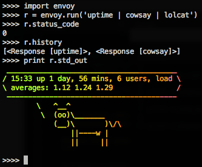

!SLIDE
# Python for Humans
(or something to that effect)

!SLIDE
# Philosophy.

!SLIDE
# We share a dark past:

Perl, Java, PHP, ColdFusion, Classic ASP, *&c*.

!SLIDE code
# The Zen of Python.
    >>> import this

!SLIDE
## Beautiful is better than ugly.

!SLIDE
## Explicit is better than implicit.

!SLIDE
## Simple is better than complex.

!SLIDE
## Complex is better than complicated.

!SLIDE incremental bullets
### If the implementation is hard to explain, it's a bad idea.

- (except pypy)

!SLIDE
### There should be one—and preferably only one—obvious way to do it.

!SLIDE
# Welcome to paradise.

!SLIDE
# <s>Welcome to paradise.</s>

!SLIDE red bigger
# LIES!

!SLIDE
# Let's mess around.

###  Maybe play with the GitHub API?

!SLIDE small code

## We know Ruby.

    @@@ ruby
    require 'net/http'
    require 'uri'

    uri = URI.parse('https://api.github.com/user')

    http = Net::HTTP.new(uri.host, uri.port)
    http.use_ssl = true

    req = Net::HTTP::Get.new(uri.request_uri)
    req.basic_auth('username', 'password')

    r = http.request(req)

    puts r

!SLIDE
# Python's net/http?

## http/url/lib/2

(better in py3)

!SLIDE

# Several hours later...

!SLIDE smaller code execute

    @@@ python
    import urllib2

    gh_url = 'https://api.github.com/user'

    req = urllib2.Request(gh_url)

    password_manager = urllib2.HTTPPasswordMgrWithDefaultRealm()
    password_manager.add_password(None, gh_url, 'user', 'pass')

    auth_manager = urllib2.HTTPBasicAuthHandler(password_manager)
    opener = urllib2.build_opener(auth_manager)

    urllib2.install_opener(opener)

    handler = urllib2.urlopen(req)

    print handler.read()

!SLIDE smaller code execute
#I lied — there's more!

    @@@ python

    import re

    class HTTPForcedBasicAuthHandler(HTTPBasicAuthHandler):

        auth_header = 'Authorization'
        rx = re.compile('(?:.*,)*[ \t]*([^ \t]+)[ \t]+'
                        'realm=(["\'])(.*?)\\2', re.I)

        def __init__(self,  *args, **kwargs):
            HTTPBasicAuthHandler.__init__(self, *args, **kwargs)

        def http_error_401(self, req, fp, code, msg, headers):
            url = req.get_full_url()
            response = self._http_error_auth_reqed(
                'www-authenticate', url, req, headers)
            self.reset_retry_count()
            return response

        http_error_404 = http_error_401

!SLIDE
# Admit it.

If this was you, you'd leave Python and never come back.

!SLIDE bullets incremental
# The Problem.

- Unclear which module to use in the first place.
- Prognosis seems to be urllib2, but the docs are terrible.
- Worst API ever.

!SLIDE bullets incremental smaller
# This is a serious problem.

- HTTP should be as simple as the print statement.

!SLIDE bullets incremental
# The Solution is Simple.

- Build elegant tools to perform these tasks.

!SLIDE
## Python needs more Pragmatic Packages.

!SLIDE dark

## pra•gmat•ic |pragˈmatik|, *adj*:
Dealing with things sensibly and realistically in a way that is
based on practical rather than theoretical considerations.

!SLIDE
# Python for Humans

!SLIDE incremental
# Let's Break it down.

What *is* HTTP at its core?

- A small set of methods with consistent parameters.
- HEAD, GET, PUSH, POST, PUT, PATCH, DELETE
- They all accept headers, url parameters, and form data.

!SLIDE incremental
# Urllib2 is Toxic.

- Heavily over-engineered.
- Abolishes most of PEP20.
- Docs are impossible to read.
- HTTP is simple. Urllib2 is absolute garbage.
- Scares people away.

!SLIDE
# Enter Requests.

!SLIDE
# HTTP for Humans.

!SLIDE

    @@@ python
    import requests

    url = 'https://api.github.com/user'
    auth = ('username', 'password')

    r = requests.get(url, auth=auth)
    print r.content

!SLIDE incremental
# Achievement Unlocked!

- A small set of methods with consistent parameters.
- HEAD, GET, PUSH, POST, PUT, PATCH, DELETE
- They all accept headers, url parameters, and form data.

!SLIDE incremental
# Do this.

!SLIDE
# The Litmus Test
If you have to refer to the documentation every time you use a module,
find (or build) a new module.

!SLIDE
# Fit the 90% Use Case.

!SLIDE
# The API is all that matters.

## Everything else is secondary.

!SLIDE incremental bullets
# I Mean ***Everything***.

- Features.
- Efficiency.
- Performance.
- Corner-cases.

!SLIDE incremental bullets
# Pivot.

- At first, Requests was far from powerful.
- Deeply resonated with people.
- Features grew over time, API never compromised.

!SLIDE incremental bullets
# Today
- Cookies, sessions, content-iteration, decompression, file uploads, async i/o, keep-alive, callback hooks, proxies, *&c*.
- 13th most–watched Python GitHub project.
- 20,000+ downloads from PyPi.
- Twitter, Library of Congress, Readability, etc.

!SLIDE  incremental bullets
# Cool Story, Bro.

- We need this.
- We want this.
- It's worth your time.
- It's worth everyone's time.

!SLIDE bullets incremental
# Subprocess

- Powerful
- Effective
- (Second) Worst API ever.
- Documentation is severely lacking.

!SLIDE bullets
# (Proposed) Solution.

!SLIDE
# File and System Operations
- sys | shutils | os | os.path | io
- Really difficult to run external commands.
- This blocks dev+ops folks from adopting Python.

!SLIDE
# Barriers to Entry

!SLIDE incremental
# Installing Python.

Decisions, decisions.

* Download installer from python.org?
* 32bit or 64bit?
* Build from source?
* If so, Unix or framework build?

!SLIDE
### There should be one—and preferably only one—obvious way to do it.

!SLIDE
# XML

- `etree` is terrible.
- `lxml` is awesome, but difficult to install.

!SLIDE incremental
# Packaging and Dependencies
- Pip or easy_install?
- Setuptools isn't included with python?
- Distribute? Why?
- No easy_uninstall?
- Broken `setup.py`s
- "Released" packages not in the Cheeseshop

!SLIDE incremental
# Date[time]s.
- Which module to use?
- Timezones
- The stdlib can generate but not parse ISO8601 dates

!SLIDE
# Unicode.

!SLIDE
# Testing.

!SLIDE incremental
# Installing Dependencies

* python-mysql
* PIL
* mod_wsgi

!SLIDE
## Unless there's an explicit requirement,
## a student should never be exposed to urllib2.

# No excuses.

!SLIDE
## The Hitchhiker's Guide to Python

http://python-guide.org

!SLIDE code top

!SLIDE bullets incremental
- A guidebook for newcomers.
- A reference for seasoned veterans.

!SLIDE small  bullets incremental
# Best Practices

- Will recommend **distribute**, **pip**, and **virtualenv** out of the box.
Explicit directions for setup on every major OS.
- Instill a resistance to `doctest`
- Teach `datetime.utcnow()`

!SLIDE
# There's only one rule.

!SLIDE
> There should be one—and preferably only one—obvious way to do it.

!SLIDE
# This Solves

- Makes Python more accessible, lowering the barrier to entry.
- Great reference guide for seasoned veterans.
- Practice what we preach.

!SLIDE red
# THE MANIFESTO

!SLIDE
# Simplify terrible APIs.

!SLIDE
# Document our best-practices.

